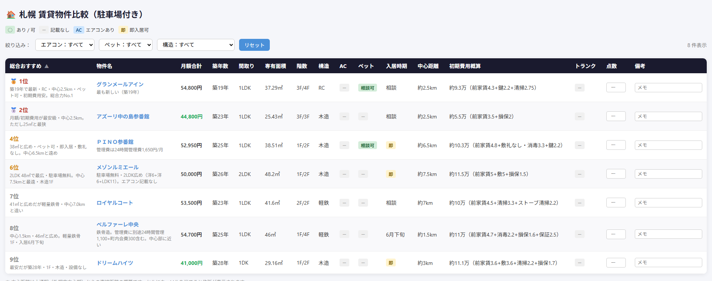

# 最近とても忙しい話

こんばんわ！最近とても忙しいちょこみんさんです。
今日は最近とても忙しくしているのはなぜかという話をします！

結論から言うと、退職の引継ぎや私の開発したシステムを非エンジニアでも管理できるようにリワーク、引っ越しの準備などです。

時系列で現在までの道のりを紹介します！

## ① 退職の申し出
時はさかのぼること2025年の末ごろ、今の会社やめようと思い社長に退職したいと相談しました。
辞めたいと思った理由はたくさんありますが、一番の理由は「近い将来に今の仕事のほとんどがAIに置き換わる」と確信したからです。

他のやめたい理由は
- スキルにあった給料がもらえていない
- 会社の年齢層にあっていない　平均40代くらい
- 管理職が向いていない
- スキルアップが見込めない

とかとか・・・。

辞めるって言っても次の仕事が決まったわけでもないのですが、ここにいるだけ時間の無駄だと判断して
一刻も早くここをやめて次の仕事を始めた方がいいと思い、退職を決心しました！

### AIの進化
私自身、仕事でもプライベートでもプログラミングをするのにAIを使用していて、AIの目覚ましい成長を肌で感じています。
かなり前、インターネットのゲーム友達にhtml、cssを教えてもらったのきっかけにプログラミングに興味を持って独学でJavascriptを習得しました。

そしてChatGPTが登場してわからないことを聴いたりしてさらに勉強を進めていき、現在ではTypescriptも書けるようになりました。
特にWeb系は作ったものが目に見えるのでとても楽しいんです。

しかし2026年現在、プログラミングはAIがする時代になりました。

## ② 仕事探し
退職の申し出を下はいいものの次の仕事についてはまだ何も考えていませんでした。

条件は決めていて、「給料が少なくていいから休日が多い、残業が少ない、将来性がある」で、
この条件でIndeedなどの求人サイトを漁っていました。

しかしこの条件に当てはまる求人はかなり少なく、その中でもいくつか気になるところを見つけて面接を受けたりしましたが書類落ちしたりでメンタルが苦しい状態に。。。

そんな時に **「業務委託」** というのに気が付きましたです。

働き方としては正社員、パート、アルバイト、派遣社員、契約社員・・・この中から選ぶものだとずっと思っていました。

> 業務委託とは、企業が自社の業務の一部や全部を、雇用関係にない外部の個人（フリーランスなど）や企業に依頼する契約形態です。仕事の完成や遂行に対して報酬が支払われ、労働時間や働き方は個人の裁量に任されます。

いわゆる個人事業主。そういえばそんなのもあったなって。
自分には全く縁のない話だと思って考えていませんでしたが、これなら自分で休日や残業、給料をコントロールできて自分にピッタリな働き方！これしかないって思いました！

そして最終的に私は **「軽貨物ドライバー」** になることを決めました。
軽貨物ドライバーになるために必要なことがたくさんありました。

## ③ 事業用の車、軽バンを購入（したい）
自分で車を持たずに、委託先から借りることもできるのですがこの場合単価などがその分引かれるそうです。
私はこの仕事を生活の基盤とし長期間この働き方をすると考えた時に自分の車の方がいろいろ都合がいいと判断して車を購入することにしました。

しかし、自分の住むアパートや近隣の月極駐車場は埋まっており、自宅から少し離れたところに月極駐車場は開いているのですが、この仕事をするにあたってそれがストレスになることが容易に想像できます。

今の住んでいる家が狭いとかペットが飼えないとかいろいろ不満があったのでこのタイミングで引越しすることを決めました。

## ④ 駐車場付きの物件探し
現在札幌市内に住んでいて、駐車場付きの物件をSUUMOで探し気になる物件を見つけて不動産屋を通じて内見まで済ませてあとは契約するだけのところまで来ました。

しかし、身寄りのない私は緊急連絡先をおじいちゃんにしたところ、高齢すぎて申請が通りませんでした。

「軽貨物ドライバーは諦めて、今の自宅から通える仕事を探す...？でもまた面接落ちで苦しんじゃうんだろうな...。」

結局諦めきれず、友人枠でも審査が通る物件を探しなおすことに。

不動産の担当者曰く、もう友人枠で通りそうなところを数で勝負するしかないとのことで、SUUMOで大量に良さそうな物件を探しました。

気になる物件のリンクをAIに渡してリスト化、自作のウェブアプリで簡単に比較できるようにしてみました。

※3位が決まった物件なので抜いてます！

## ⑤ ついに審査が通る
いくつか同時に審査を進めていたうちの一つ、駐車場付きの1DK、エアコン付き、ペット相談可の物件の審査が通って無事に契約できました！
前家賃や敷金などの初期費用は合計で22万越え...；；

駐車場がないと車が購入できなかったのでようやく進めるように！
ここまで来たらもう後戻りできない！！！やるしかない！！！
（元うつ病とは思えない頑張り、褒めて）

### 睡眠不足で病院に行く
今の仕事が夜勤でいろいろ手続きや連絡が日中にしかできないので、夜勤明けて寝ても電話で起こされたり、そのまま外に出たりでほぼ毎日睡眠に問題を抱えていました。

過去に不眠症になったことがある私は睡眠不足が与える悪影響は良く理解していたので、すぐに病院に行って強制的に眠れるように睡眠剤をもらいに行くなど...。

心身ともにすり減っているのを感じつつ「生きている」という実感を感じていました。

## ⑥ そしてついに車を購入する
軽貨物で使われる車はスズキのエブリイ、ダイハツにのハイゼットカーゴなどが主流なようで、中古車市場でたくさん流通していて入手性やリセールを考えてこの2車種から選ぶことにしました。

カーセンサーでよさげなのを見かけて販売店に連絡したところまだ在庫があるようなので、自転車で1時間かけて中古車販売店まで向かいました。

お店の人も感じが良くて、オプションなどの相談もしてその場で購入することに。
乗り出し価格96万、キャッシュ一括で購入しました...。（頑張って溜めた貯金が；；）

## ⑦ 引越し準備
ちなみにこの記事を書いている今（2026/06/24）は入居日の前日です。

- 何を残して何を新しく買うか断捨離
- ライフラインの停止と開始の手続き
- 入居日の調整やスケジュール調整
- ドラム式洗濯機の購入
- ネットの撤去工事の問い合わせとかとか

無限にやることがありましたが、入居前にすべきタスクは無事に全て終わって荷物をまとめている段階です。

入居日になったら終わるんじゃなくて住所変更やも盛りだくさん！こんな感じでずっと忙しかったんです。

## 明日以降のこと

6/25は納車＆入居日！

朝に車を受け取りに行って、家に帰って荷物積んで、入居立会して、荷物搬入して、ガスの立会して...

そしておちんついたら住所変更、軽貨物ドライバーとして働き始めるために適性診断や黒ナンバーの取得、任意契約の変更とか！もう本当にやることがたくさん！

せっかくの転職なので少しだけﾆｰﾄ期間を楽しんでもいいかなって考えてはいたのですが、車買ったり引っ越し費用だったりで瞬間的に140万近くつかってしまって貯金に余裕がないのでなるはやで働き始めようって思っています。

そしてここからがスタートなんだよね...本当に人生って生きるだけで難しいって思いました。

## おわり
こんな感じで多分7月半ばくらいまでずっと忙しくて本当に命すり減らしながら頑張っています。

軽貨物ドライバーは体力のいる仕事で、今はデスクワークだし、家でもゲームばかりのインドア派で慣れるまで絶対に苦労するのが目に見えています。

本当に落ち着くのは9月とかになるかなぁ。
そしたらたくさん時間ができてプライベートを楽しめるようになって、きっとこれからの人生が明るくなる...よね？

ここまで読んでくれてありがとうございました！
そしたらたくさん遊んでね。