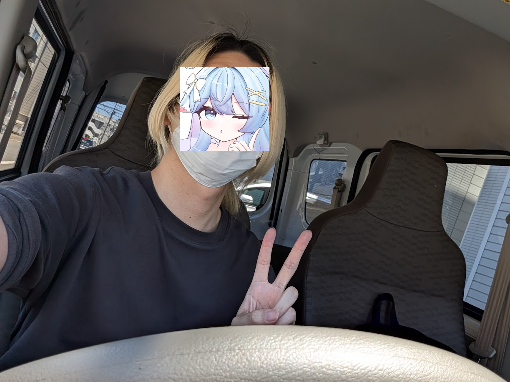
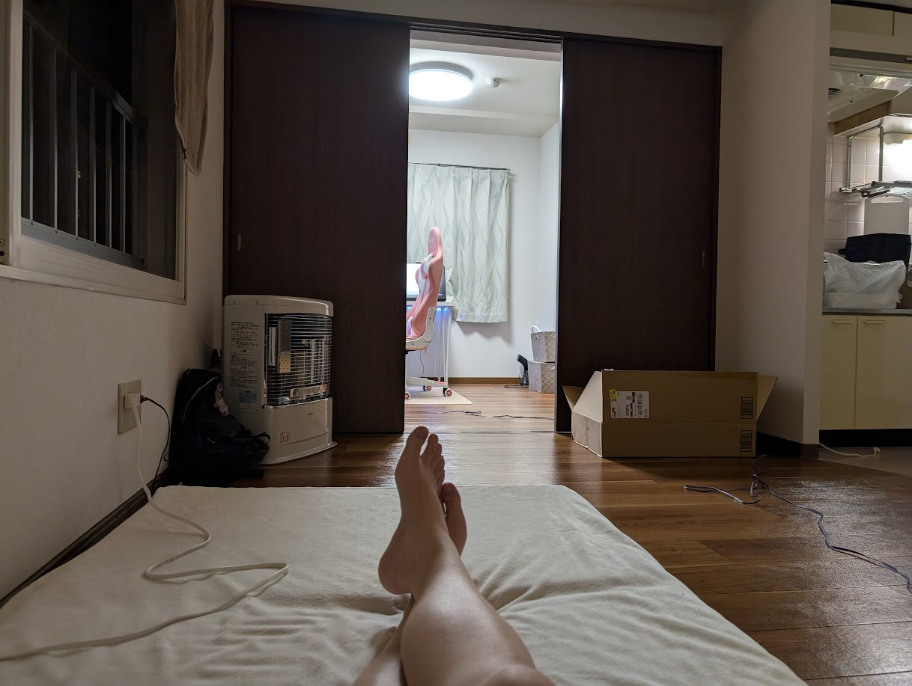
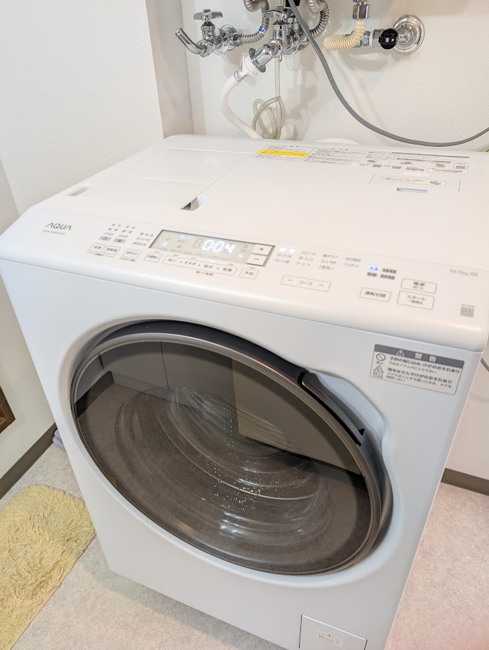
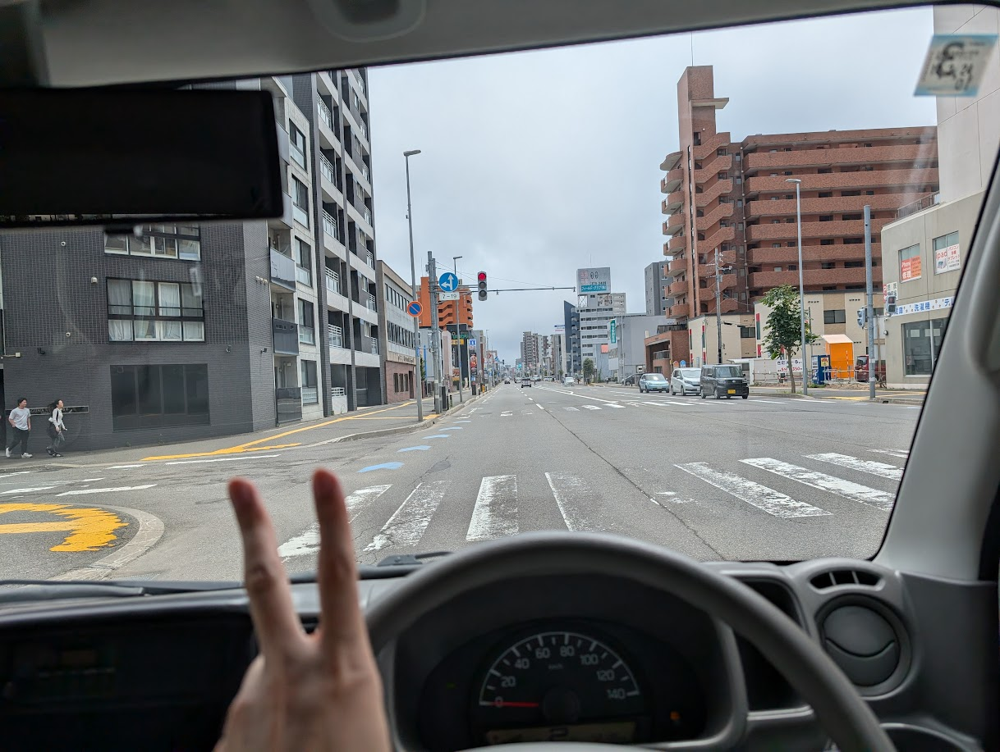
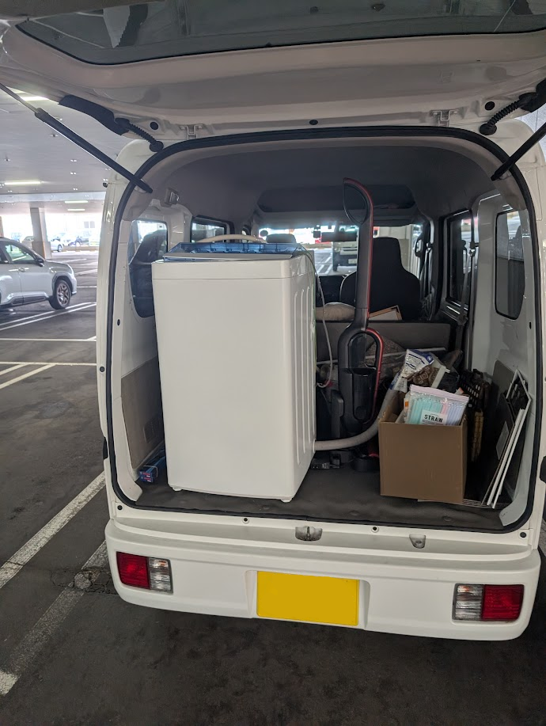
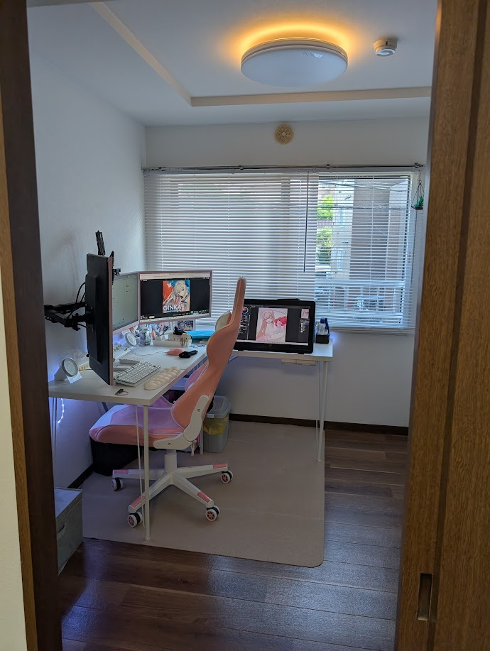

# 無事に引越しが終わりました！（執筆途中

こんばんわに🐊✨好きな食べ物はサーモンです。

6/25から始まった引越しですが、3日間かけて無事に完了しました！  
新しいお家、車、大変だったこととかのお話です。

## 1日目の朝、納車
夜勤明けにすぐ寝たもののアラームよりも早く来てしまいました。  
眠い中、納車の時間ぎりぎりまで引っ越しのための荷物をまとめていました。

車屋さんはお家から自転車で1時間ほどでしかも上り坂。  
行くのが大変だという話を会社でしていたら、優しい人が車屋さんまで送ってくれるとのことで9時半に迎えに来てもらいました！

車屋さんに到着したら自分の車が置いてあって「ついに夢のマイカー...！」期待に胸を膨らませつつ、「1年以上ぶりの運転で事故ったらどうしよう」という心配も。
私は免許自体は10年前くらいにとって年に1回程度レンタカーで遠出するくらいのペーパーゴールドなのです。

ウォッシャー液の補充方法など、事前に用意しておいた車についての質問を聞いて

車屋さん「あと何か聞いておきたいことはありますか？」  
ちょこみん「ｳｰﾝ､大丈夫だと思います！たぶん！」  
車屋さん「...ｗ」

## マイカー初運転
そんなこんなで車屋さんを出発！ﾌﾞｰﾝ！ｶﾞｺﾝ！うなるエンジン！

購入した車は5AGSというミッション（？）で中身がマニュアルの実質オートマみたいなものになっており、変速ショックが大きいのが特徴。

> 5AGS（5速オートギヤシフト）は、マニュアルトランスミッションを自動で変速・クラッチ操作する仕組みです。  
AT限定免許で運転でき、ATより燃費が良い傾向があります。
一方で、変速時にMTのようなショックや加速の途切れを感じやすいのが特徴です。

2ND発進モードっていうのにするといい感じに発進できるようになりました。

## いざ、新居立ち合いへ
車屋を出発して旧宅に帰り、荷物を積めるだけ積んで新居立ち合いへ。  
旧宅からは片道20分ちょっとでつく距離です。

人生で初めて市内を運転しましたが、とにかく車が多いのと5車線とかあったり路駐を避けたりとかで難しいって感じました。

新居についたけど管理人がいなくて玄関前で立ち尽くしていて、試しにドアを開けてみたら中にいて  
「あ...入居するちょこみんです...」

管理人から入居にあたっての説明、鍵の受け渡しなど。

## 荷物の搬入
3日間ありますが、初日から新居で生活ができるようになるべく優先度の高い物から搬入。  
パソコンx2、デスクx2、ゲーミングチェア、モニターx3、液タブ...。

15時くらいにガス開栓の立会があって、それまで車に積んできたものを全部搬入しました。  
そのあとは夜までまだ時間があったので旧宅に戻り第2便を積み込んでまた新居へ。  
シーリングライトが付いてないとかでかいにいったりなんだり...。

夜になり、体力が限界を迎えてシャワーを浴びてチルタイム、気絶するように眠りにつきました。

---

## 2日目が始まる
寝たのが早かったせいで朝4時くらいに目が覚めました。  
2日目の予定は午前中に洗濯機の設置立会、その後に区役所に行って転居届を出すの２つでその合間に荷物の搬入を進めていきます。

昨日搬入しきれなかったものを車から運び出して、そのあとは休憩がてらにデスク環境のセットアップを進めました。

## ドラム式洗濯機
ついに人生初のドラム式洗濯機！ピカピカの新品✨

これまでの人生で縦型しか使ったことがなくて、いつも干すのが大変って感じていました。  
しかも、洗剤も自動投入で本当に楽になりました！

洗濯が終わって取り出してみるとホカホカでしっかり乾燥していて本当に感動しました...！  
高かったけど買ってよかった！

## ニトリに行く
洗濯機の設置後、本当は区役所に行く予定でしたがこの時間混んでると予想して先にニトリで買い物をすることに。

買う予定があったのは
- 電子レンジラック
- バスタオルとかを置くプラ製のラック
- ブラインド
- 洋室用の棚

なのですが、棚が思ってるより高くて一旦は買わないでおくことにしました。  
車があるおかげでこういう大きな買い物もらくちん！

## 区役所に行く
転居届を出すために区役所に来ました。  

転居届を書いていると「本籍...？戸籍筆頭者...？」  
どうやらこれはマイナポータルでは確認できないようで、住民票を出すしかないことがわかりました。
区役所でも住民票は出せるのですが混んでいるうえに料金も400円で高いので、近くのコンビニに行くことにしました。

> コンビニなら早いし200円で出せます。

そんなこんなで転居届とマイナンバーカードの住所変更が完了しました。

## 2日目の夜
その後はまた旧居に帰って荷物を積んでは運びを繰り返し、7割くらい運んだところで夜に。  
全身汗だく、筋肉痛、お風呂を焚いて全身すっきりさせたら「今日はＶ睡しようかな」って思ったけど、明日に支障が出そうだったので結局そのまま気絶するように就寝しました。

---

## 3日目、最終日
この日は朝の2時半ころに1回目が覚めて、少しだけゲームしてまた寝て5時頃に起床しました。  
最終日の予定は旧居の蛇口交換の立会と洗濯機処分のふたつ。

今日で全てを終わらせる！！！
しかし、ここで懸念していた一番の強敵「冷蔵庫」との戦いが始まる。

## 冷蔵庫との戦い
左右に揺らしながら少しずつ家の外へ運んで、気合で持ち上げて車に積み込みました。  
新しいお家は2階でこの時点で「あれこれマジで2階に運ぶのムリじゃね...？」そう思いつつ他の荷物を積んで新居へ。

車から降ろすのも一苦労、人が通ってから降ろそうとして待っていたら

通りすがりのおじいさん「一人で大丈夫かい？」  
ちょこみん「ｳｰﾝ､大丈夫だと思います！気合で何とかします！」  
通りすがりのおじいさん「そうかい、頑張ってね」

とりあえず新居の玄関まで運ぶことができましたが問題は階段。  
とにかく狭くて、1段ずつ冷蔵庫の右前足を乗せてから左前足のように上げていきました。

途中で冷蔵庫の重さに負けて倒れそうになってゲチで冷や汗ドバドバ！！！
人生で一番は盛ってるけど、それくらい大変な思いで無事にお部屋まで運ぶことができました。

みんなはマネしないで引越し業者にお願いしよう。

## 蛇口交換の立会
なんでこのタイミングなのかというと、引っ越しの少し前に蛇口からの水漏れがあり、退去の時に言うと退去費用に上乗せされるんじゃね？って思ったので事前に直してもらうように連絡していました。そのせいで退去直前になったわけです。

立ち合いの最中に洗濯機を取り外して、これは持ち手が付いていて冷蔵庫に比べたら全然軽くて問題なく積み込みができました。

自転車と物干し竿？以外の荷物は全て車に積み込むことができました。

## ラストスパート！ひたすら荷物を運ぶ！
今日で終わらせたかったのですが、その前に体力が力尽きました...。

## 余談：setlogが面白い話
いつもネトゲで遊ぶメンバーでsetlogっていうSNSやろうってなって始めたこれが結構面白い

> Setlog（セットログ）とは、1時間ごとに2秒の動画を撮影し、仲の良い友人グループと共有しながらその日の日常Vlogを自動で作成できるスマートフォン向けSNSアプリです。  
韓国発のアプリですが、日本でもZ世代を中心に大流行しています。

投稿を見れるのがグループの人だけなのでTwitterと違って個人情報とか顔とかありのままを投稿出来てその人の素が見れるのがすごくいい！

1時間ごとに1回、2秒の動画を投稿できて、誰かが投稿すると通知が来て、その通知を見てまた投稿してっていう感じで今何しているかが共有できるのが楽しいので皆さんもぜひやってみて！